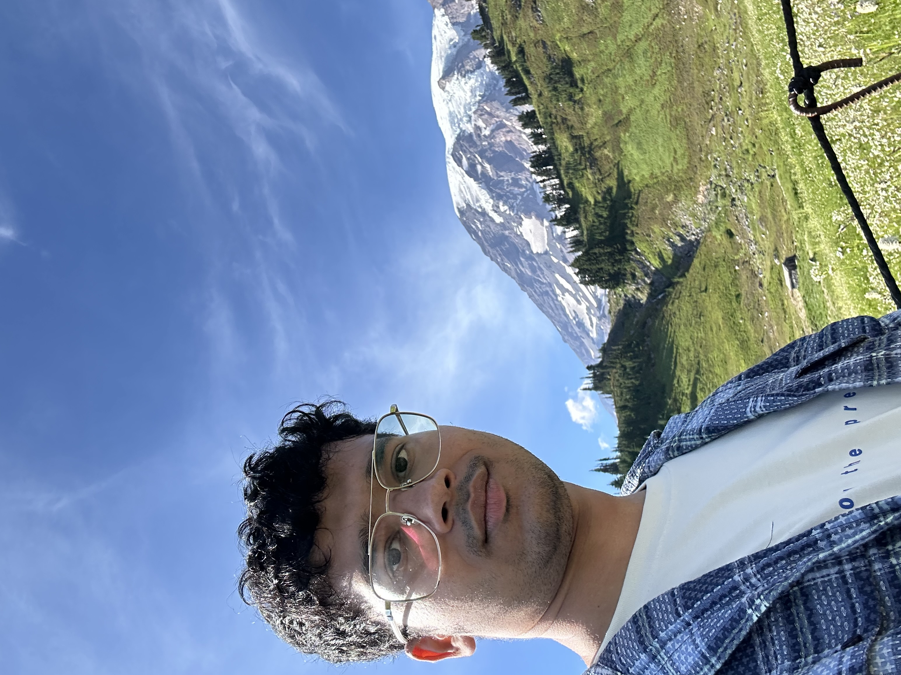
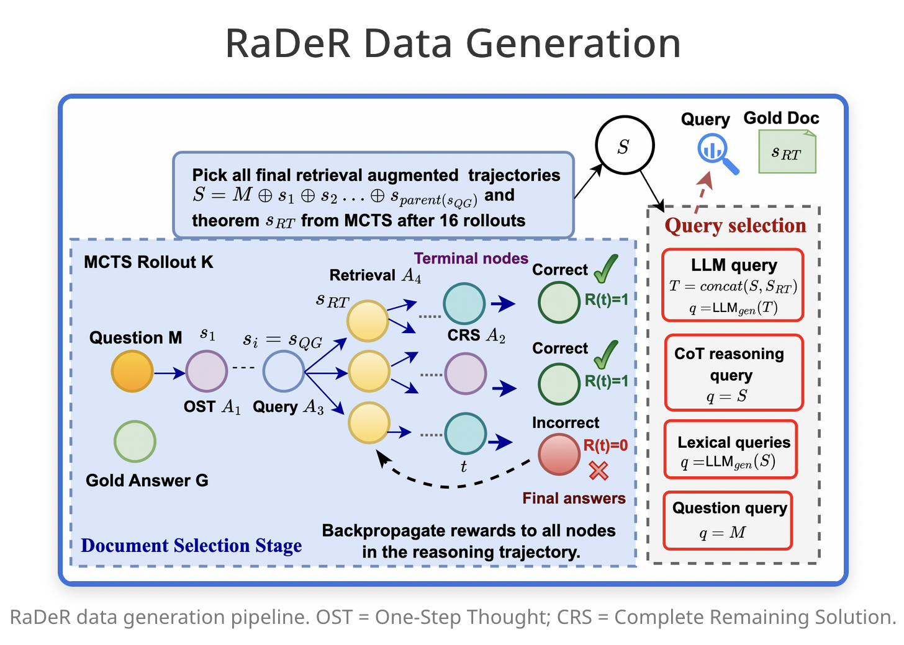
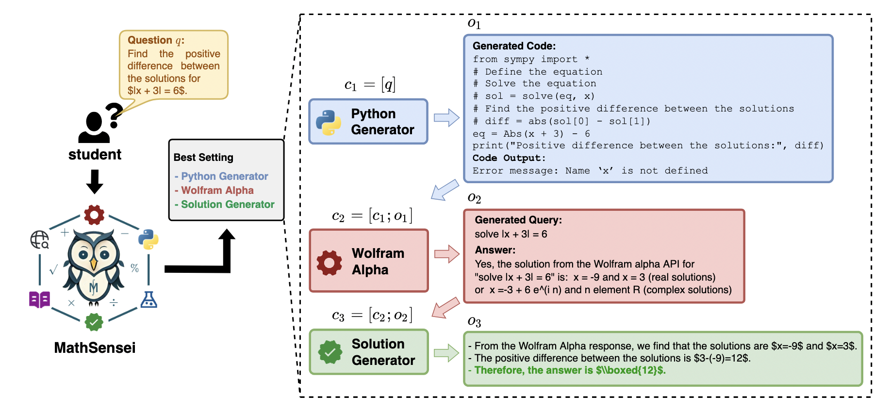
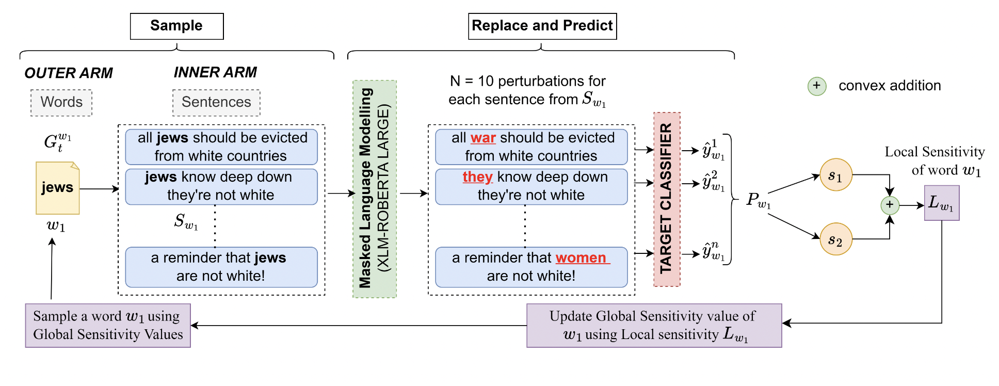

  

    
  

  

    
   I am a 1st year Computer Science PhD student at the <a href="https://www.cics.umass.edu/">Manning College of Information & Computer Science</a>, <a href="https://www.umass.edu/">University of Massachusetts Amherst</a>. I am advised by  <a href="https://people.cs.umass.edu/~rahimi/">Prof. Negin Rahimi</a>. My broad research interests are primarily in Information Retrieval (IR) and Natural Language Processing (NLP). Prior to this, I received a Dual Degree (Bachelors + Masters) in Mathematics and Computing from IIT Kharagpur, India where I worked on the paradigm of tool-augmentation for mathematical reasoning in LLMs, supervised by <a href="https://adityasomak.github.io/">Prof. Somak Aditya</a>.
      
    My overarching research goals are focused on the effective utilization of retrieval-based systems and external structured knowledge to improve multiple reasoning dimensions in LLMs. Currently, I am interested in developing advanced retrieval systems for reasoning-intensive tasks, where retrievers perform multi-step, complex reasoning across multiple turns, leveraging both intermediate outputs and previously retrieved information. I am working on agentic retrieval frameworks, using reinforcement learning to train retrievers with step-wise feedback in dynamic environments. My other research interests revolve around the use of neuro-symbolic methods in NLP, and trying to make LLMs safer to use in social contexts.
  

 

<html lang="en">
<head>
    <meta charset="UTF-8">
    <meta name="viewport" content="width=device-width, initial-scale=1.0">
    <title>News Slider</title>
    
</head>

<body>
  <section id="updates">
    <h3>Updates/News</h3>
    

      

        <h4>(08/25) <a href="https://arxiv.org/abs/2505.18405"> RaDeR: Reasoning-aware Dense Retrieval Models</a> accepted as Main Conference Paper at EMNLP 2025, Suzhao, China! </h4>
      

      
      

        <h4>(09/24) Started my PHD at UMass Amherst - advised by Prof. Negin Rahimi!</h4>
      

      

        <h4>(04/25)
          Joint work with <a href="https://mbzuai.ac.ae/">MBZUAI</a>, <a href="https://aclanthology.org/2025.naacl-long.463/">"SMAB: MAB based word Sensitivity Estimation Framework and its Applications in Adversarial Text Generation"</a> accepted as Main Conference paper at <a href="">NAACL 2025</a>, New Mexico.
        </h4>
      

      
      

        <h4>(06/24) Presented my main conference paper on 
          <a href="https://aclanthology.org/2024.naacl-long.54/">"MATHSENSEI: A Tool-Augmented Large Language Model for Mathematical Reasoning"</a> 
          at <a href="https://2024.naacl.org/">NAACL 2024</a>, Mexico City.
        </h4>
      

      

        <h4>(12/23) Completed my internship at 
          <a href="https://global.rakuten.com/corp/">Rakuten Global Inc.</a>, Language and Speech Team, RIT India.
        </h4>
      

  
    
  
  </section>

  <section id="publications">
  <h2>Publications</h2>

  

    

      
    

    

      <h3>RaDeR: Reasoning-aware Dense Retrieval Models</h3>
      

         <strong>Debrup Das</strong>, Sam O' Nuallain, Razieh Rahimi
         
        <em>Main Conference Paper at EMNLP 2025, Suzhao, China </em>
      

    

  

  

    

      
    

    

      <h3>MATHSENSEI: A Tool-Augmented Large Language Model for Mathematical Reasoning</h3>
      

        <strong>Debrup Das</strong>, Debopriyo Banerjee, Somak Aditya, Ashish Kulkarni
        <em>Main Conference Paper at NAACL 2024, Mexico City</em>
      

    

  

  <!-- Add more publications in the same format -->
  

    

      
    

    

      <h3>SMAB: MAB based word Sensitivity Estimation Framework and its Applications in Adversarial Text Generation</h3>
      

        Saurabh Kumar Pandey, Sachin Vashistha, <strong>Debrup Das</strong>, Somak Aditya, Monojit Choudhury
        <em>Main Conference Paper at NAACL 2025, New Mexico</em>
      

    

  

</section>

</body>

</html>
