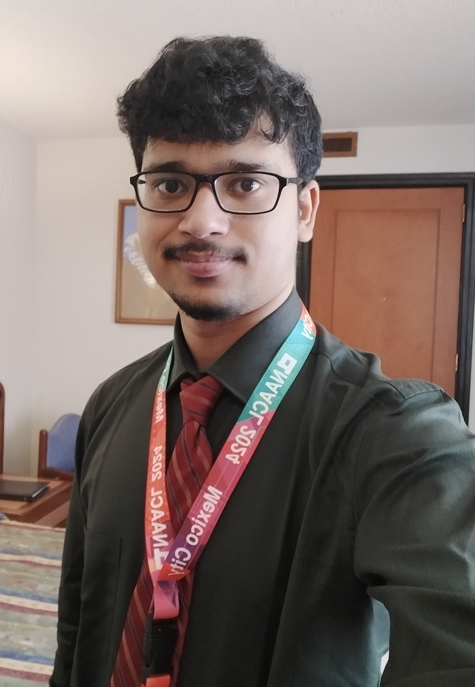

  

    
  

  

    
   I am a 1st year Computer Science PhD student at the <a href="https://www.cics.umass.edu/">Manning College of Information & Computer Science</a>, <a href="https://www.umass.edu/">University of Massachusetts Amherst</a>. I am advised by  <a href="https://people.cs.umass.edu/~rahimi/">Prof. Negin Rahimi</a>. My broad research interests are primarily in Information Retrieval (IR) and Natural Language Processing (NLP). Prior to this, I received a Dual Degree (Bachelors + Masters) in Mathematics and Computing from IIT Kharagpur, India where I worked on the paradigm of tool-augmentation for mathematical reasoning in LLMs, supervised by <a href="https://adityasomak.github.io/">Prof. Somak Aditya</a>.
      
    My current research interests are focused on the effective utilization of retrieval-based systems and external structured knowledge to improve multiple reasoning dimensions in language models. My other interests revolve around the use of neuro-symbolic methods in NLP, and trying to make LLMs safer to use in social contexts.
  

 

<html lang="en">
<head>
    <meta charset="UTF-8">
    <meta name="viewport" content="width=device-width, initial-scale=1.0">
    <title>News Slider</title>
    
</head>
<body>
    <section id="updates">
        <h3>Updates/News</h3>
        

            

                <h4>(06/24) Presented my main conference paper on <a href="https://aclanthology.org/2024.naacl-long.54/">"MATHSENSEI: A Tool-Augmented Large Language Model for Mathematical Reasoning"</a> at <a href="https://2024.naacl.org/">NAACL 2024</a>, Mexico City.</h4>
          <h4>(04/24) Accepted as a CS PHD Student at UMass Amherst - advised by Prof. Negin Rahimi !</h4>
          <h4>(12/23) Completed my internship at <a href="https://global.rakuten.com/corp/">Rakuten Global Inc.</a>, Language and Speech Team, RIT India.</h4>
            

           

           <h4>(06/23) Started working on Hate speech and Jailbreaks as part of Microsoft AFMR Program advised by Prof Somak Aditya (IIT KGP) and <a href="https://mbzuai.ac.ae/study/faculty/monojit-choudhury/">Prof Monojit Choudhury (MBZUAI)</a>.</h4>
           <h4>(12/22) Completed my research internship at Genome Quebec Innovation Centre, McGill University - supervised by Prof. Simon Gravel.</h4>
            <h4>(05/21) Worked in the field of Genetic Algorihtms, supervised by Prof Nirupam Chakraborti, Czech Technical University.</h4>
           

        

        <button id="prev-update">&#8592;</button>
        <button id="next-update">&#8594;</button>
    </section>

    
</body>
</html>
