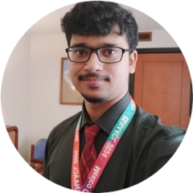
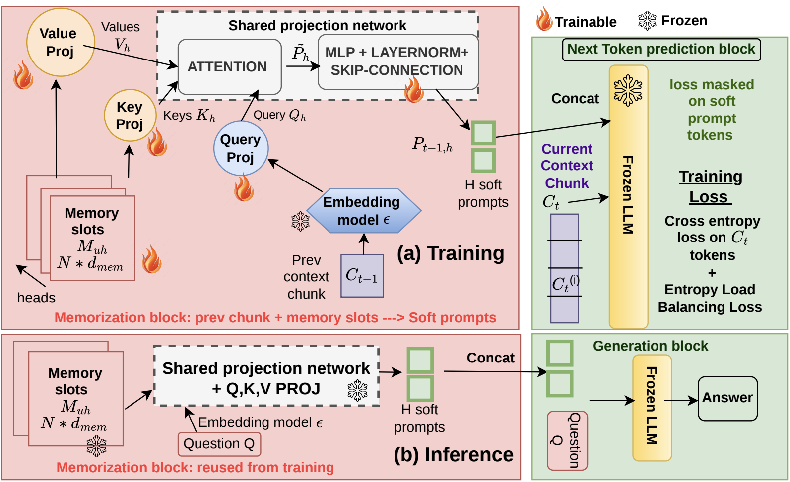
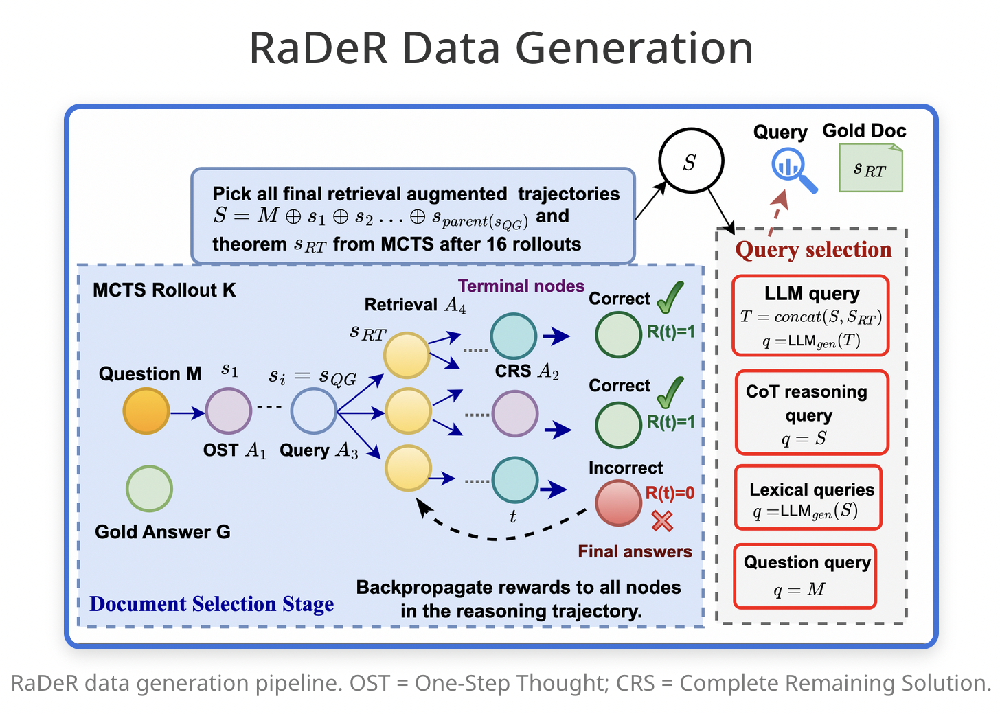
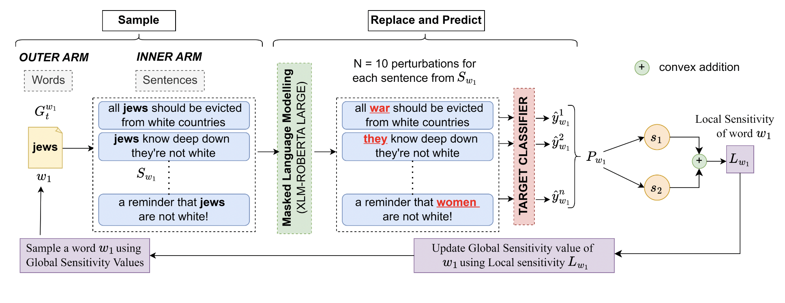
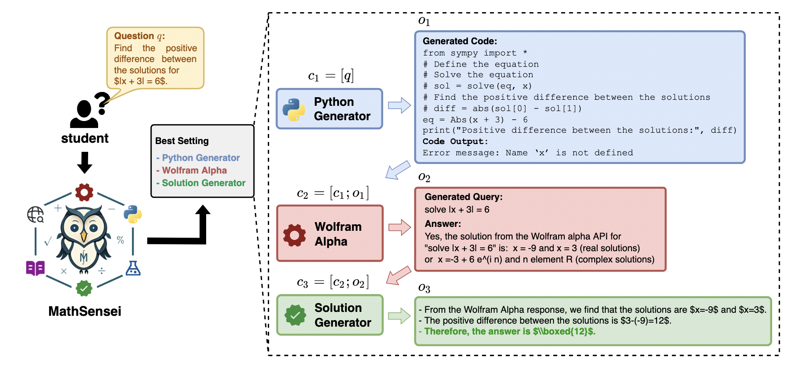

<section class="bio">
  

    
    
Debrup Das

    
CS PhD Student UMass Amherst

    

      <a href="DebrupDasCV.pdf">CV</a>
      <a href="mailto:debrupdas@umass.edu">Email</a>
      <a href="https://github.com/Debrup-61/">GitHub</a>
      <a href="https://www.linkedin.com/in/debrup-das-6448a41a7/">LinkedIn</a>
    

  

  

    

      I am a 3rd year Computer Science PhD student at the <a href="https://www.cics.umass.edu/">Manning College of Information &amp; Computer Sciences</a>, <a href="https://www.umass.edu/">University of Massachusetts Amherst</a>, and a member of the <a href="https://ciir.cs.umass.edu/">Center for Intelligent Information Retrieval (CIIR)</a>. I am advised by <a href="https://people.cs.umass.edu/~rahimi/">Prof. Negin Rahimi</a>. My broad research interests are in Information Retrieval (IR) and Natural Language Processing (NLP). Prior to this, I received a Dual Degree (Bachelors + Masters) in Mathematics and Computing from IIT Kharagpur, India, where I worked on tool-augmentation for mathematical reasoning in LLMs, supervised by <a href="https://adityasomak.github.io/">Prof. Somak Aditya</a>.
    

    

      My research focuses on building retrievers that reason about relevance rather than matching surface similarity. I am currently working on: (1) scaling test-time thinking for reasoning-intensive retrieval, (2) reinforcement learning approaches to train retrievers optimized under embedding objectives and retrieval rewards, and (3) memory-augmented systems that retrieve and continually learn from past experiences.
    

  

</section>

<h2 class="section-title">News</h2>
<ul class="news">
  <li>
    Aug 2026
    <a href="https://arxiv.org/abs/2606.20911">Latent Personal Memory: Represent Personal Memory as Dynamic Soft Prompts</a>, my internship work at Samsung Research America, accepted to Findings of EMNLP 2026, Budapest!
  </li>
  <li>
    May 2026
    Completed my research internship at <a href="https://sra.samsung.com/">Samsung Research America</a>, AI Center, Mountain View.
  </li>
  <li>
    Feb 2026
    Started a research internship at <a href="https://sra.samsung.com/">Samsung Research America</a>, AI Center, Mountain View, working on latent-memory-augmented systems for long-context personalized user memory.
  </li>
  <li>
    Aug 2025
    <a href="https://aclanthology.org/2025.emnlp-main.1011/">RaDeR: Reasoning-aware Dense Retrieval Models</a> accepted as a Main Conference paper at EMNLP 2025, Suzhou, China!
  </li>
  <li>
    Apr 2025
    Joint work with <a href="https://mbzuai.ac.ae/">MBZUAI</a>, <a href="https://aclanthology.org/2025.naacl-long.463/">SMAB: MAB based Word Sensitivity Estimation Framework and its Applications in Adversarial Text Generation</a>, accepted as a Main Conference paper at NAACL 2025, Albuquerque, New Mexico.
  </li>
  <li>
    Sep 2024
    Started my PhD at UMass Amherst, advised by Prof. Negin Rahimi!
  </li>
  <li>
    Jun 2024
    Presented <a href="https://aclanthology.org/2024.naacl-long.54/">MathSensei: A Tool-Augmented Large Language Model for Mathematical Reasoning</a> at <a href="https://2024.naacl.org/">NAACL 2024</a>, Mexico City.
  </li>
  <li>
    Dec 2023
    Completed my internship at <a href="https://global.rakuten.com/corp/">Rakuten</a>, Language and Speech Processing Team, RIT India.
  </li>
</ul>

<h2 class="section-title">Publications</h2>

  

  

    
Latent Personal Memory: Represent Personal Memory as Dynamic Soft Prompts

    
<strong>Debrup Das</strong>, Avinash Amballa, Yashas Malur Saidutta, Vijay Srinivasan, Vivek Kulkarni, Srinivas Chappidi

    EMNLP 2026 Findings
    

      <a href="https://arxiv.org/abs/2606.20911">Paper</a>
    

  

  

  

    
RaDeR: Reasoning-aware Dense Retrieval Models

    
<strong>Debrup Das</strong>, Sam O'Nuallain, Negin Rahimi

    EMNLP 2025 Main
    

      <a href="https://aclanthology.org/2025.emnlp-main.1011/">Paper</a>
      <a href="https://debrup-61.github.io/RaDeR.github.io/">Website</a>
    

  

  

  

    
SMAB: MAB based Word Sensitivity Estimation Framework and its Applications in Adversarial Text Generation

    
Saurabh Kumar Pandey, Sachin Vashistha, <strong>Debrup Das</strong>, Somak Aditya, Monojit Choudhury

    NAACL 2025 Main
    

      <a href="https://aclanthology.org/2025.naacl-long.463/">Paper</a>
    

  

  

  

    
MathSensei: A Tool-Augmented Large Language Model for Mathematical Reasoning

    
<strong>Debrup Das</strong>, Debopriyo Banerjee, Somak Aditya, Ashish Kulkarni

    NAACL 2024 Main
    

      <a href="https://aclanthology.org/2024.naacl-long.54/">Paper</a>
      <a href="https://rit.rakuten.com/news/2024/research-on-mathematical-reasoning-accepted-at-naacl-and-me-fomo-2024/">Rakuten News</a>
    

  

